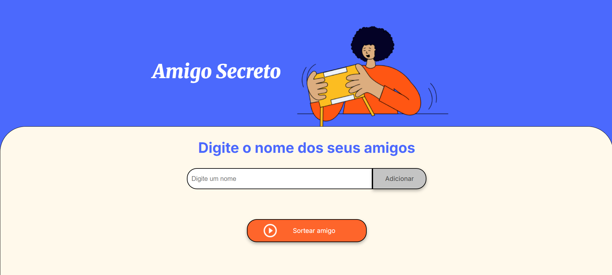
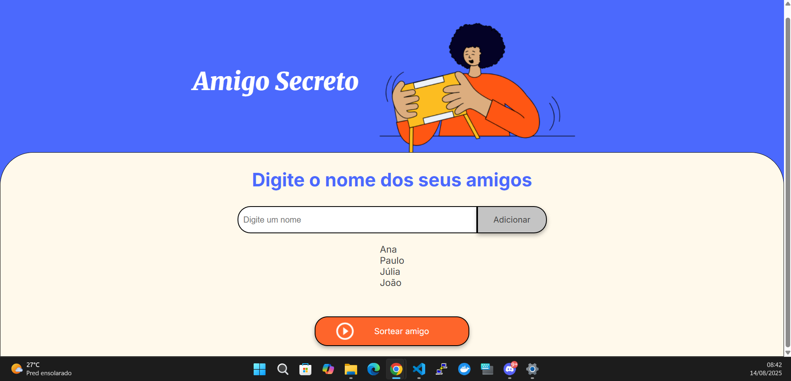
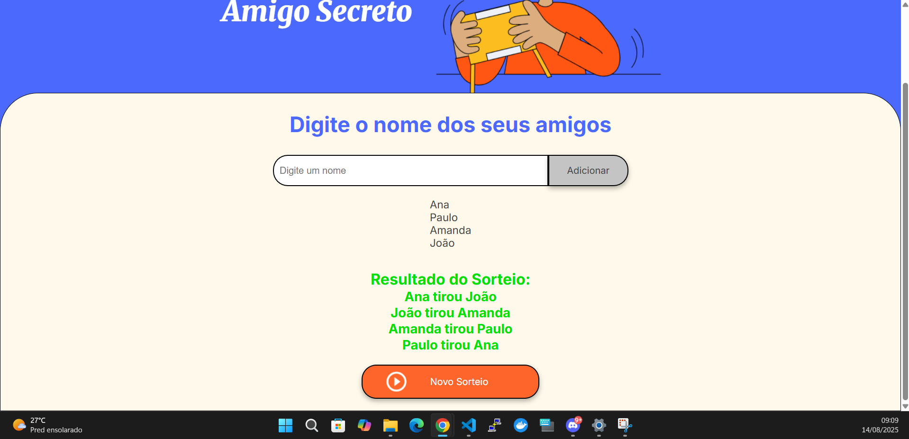

# 🎁 Amigo Secreto

Uma aplicação simples e interativa para realizar sorteios de **Amigo Secreto** diretamente no navegador.  
Permite adicionar nomes, visualizar a lista de participantes e realizar o sorteio garantindo que ninguém tire a si mesmo.

---

## 🚀 Funcionalidades

- **Adicionar participantes** através de um campo de texto.
- **Listar participantes** adicionados.
- **Sorteio automático** que impede que a pessoa tire a si mesma.
- **Exibição clara do resultado** para todos os participantes.
- **Opção de reiniciar** e realizar novo sorteio.
- Interface amigável e intuitiva.

---

## 🖼️ Demonstração em GIF


---

## 🖼️ Capturas de Tela

### 1️⃣ Tela Inicial  
Permite digitar o nome dos participantes e iniciar a lista.  


---

### 2️⃣ Participantes Adicionados  
Visualize a lista de amigos que participarão do sorteio.  


---

### 3️⃣ Resultado do Sorteio  
Mostra quem tirou quem no Amigo Secreto.  


---

## 🛠️ Tecnologias Utilizadas

- **HTML5** → Estrutura da página  
- **CSS3** → Estilização e layout responsivo  
- **JavaScript (ES6+)** → Lógica do sorteio e manipulação do DOM  

---

## 📦 Como Executar Localmente

1. **Clone este repositório**
   ```
   git clone https://github.com/seuusuario/amigo-secreto.git
2. **Entre na pasta do projeto**
    ```
    cd challenge-amigo-secreto
3. **Abra o arquivo index.html no navegador**
    ```
    Basta clicar duas vezes no arquivo ou abrir com botão direito → "Abrir com navegador".

## ✍️ Desenvolvido por Paulo Vítor Pereira